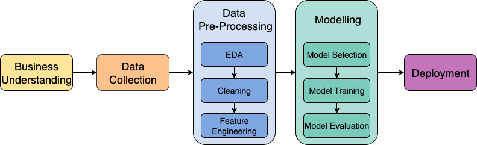

<h1 align="center">Loan Approval Prediction Model
</h1>

  
  
  
  

  
  
  

   
  <em>Demo: Loan Approval Prediction Model </em>

The deployment of live demo of Loan Approval Prediction Model is here: 
🚀 <a href=" https://loan-approval-prediction-model-f2e70fd9ef88.herokuapp.com/"><b>Live Demo</b></a>  

## What's this model about?
The Machine Learning model for Loan Approval Prediction is a supervised learning using classification algorithms. This model was trained using the variables from the dataset to determine which variables were the driving force of good loans and bad loans. If the model predicts an applicant to be a good loan, it means the loan can be approved; and if the model predicts a bad loan, then the application from this applicant should be rejected. 

## The Development Process

   
  <em>Machine Learning Workflow </em>

## Tech Stack

### Core Libraries

### Tools

### IDE

## Business Understanding
LendingClub (LC) was a marketplace for a peer-to-peer lending company where investors (individuals/ businesses) could lend out loans to borrowers (individuals/ businesses). Like any lending institution, the company had risks of loans wouldn’t be paid by the borrowers (credit loss). Thus, the company needed to assess risks, especially for loan applications from new applicants. If the company can identify potential bad loans, it can reduce the risks of credit loss. Since the risks of credit losses is bigger compared to the revenue from good loans, the company preferred to focus more on finding the bad loans, which could lead to more stringent loan approvals. 

 The purpose of this project is to build a predictive machine learning model to predict whether an applicant can be a potential good or bad loan that will lead to its approval or rejection. The problem is, the company wanted more stringent loan approvals, and at the same time, the company needed to approve loans to generate revenue. Thus, this ML model needs to balance out the rejections vs the approvals, but still leans toward conservative approvals. 

 ## The Dataset
This model is using dataset from LendingClub which has 75 feature columns and 400+k input rows.

## Exploratory Data Analysis (EDA)

- From 75 features, 57 features were dropped due to: significant missing values, data leakage, irrelevant, uninformative for classification, high correlation >90%.
- The final features: 17 predictive features & 1 target feature (loan_status)

## Feature Engineering

- Feature transformation - converting categorical to numerical data
- One-hot-encoding to convert categorical feature to numerical feature.
- Label encoding to transformation by labelling categorical value as numeric label

## Modelling

### Target Variable: 
loan_status: Good loan (0), Bad loan (1)

### Algorithms:

This model is trained with Supervised learning, classification algorithms:
- Decision Tree Classification
- Random Forest Classification
- XGBoost Classification

### Hyperparameter Tuning:
- RandomizedSearch
- Cross-validation

### Final Model:
- Stacking model: XGBoost + DecisionTree as estimators, and RandomForest as final estimator
- Blended model: XGBoost + DecisionTree + RandomForest + Stacking Model. 
  Blended model is weighted to ensure the best performance

   
  <em>Stacked Model Combined with Three Algorithms for the Final Blended Model </em>

## Model Evaluation

### Performance metrics: 
- Recall 
- Precision 
- f1
- accuracy
- ROC-AUC
- Precision-Recall

Focus on Recall 1 (bad loan) & 0 (good loan) and Precision-Recall
Blended model is weighted to ensure the best performance

## Model Deployment
- Pickle the Blended model as the best model.
- POST API via Postman.
- Commit and push saved files to GitHub.
- Integrate with the Herokuapp to deploy the model
- Model is ready to be used here: https://loan-approval-prediction-model-f2e70fd9ef88.herokuapp.com/

   
  <em>Deployment Flow and Tools </em>

